<picture><source media="(max-width: 1011px) and (prefers-color-scheme: dark)" srcset="art/header-m-dark.svg"><source media="(max-width: 1011px)" srcset="art/header-m-light.svg"><source media="(prefers-color-scheme: dark)" srcset="art/header-dark.svg"></picture>

Staff AI Engineer at **TaskRay**. I build production AI systems and the infrastructure that keeps them honest.

Before that, nearly ten years at **GoDaddy**. The last two were on an agentic AI feature for **Airo Site Designer** with multi-agent tool routing across six agent layers, and I cut LLM inference cost 93% on an earlier retrieval pipeline. A contract at **McLean Forrester** built a CI-gated LLM evaluation framework on **Promptfoo** that caught a 39-point quality regression before it shipped.

Also maintain [Tracine](https://tracine.dev), open-source tooling for AI coding agents.

- **[guard](https://github.com/TracineHQ/guard).** Seven PreToolUse validators that deny or ask with feedback, plus a permission-prompt logger and a JSONL decision log.
- **[convo](https://github.com/TracineHQ/convo).** SQLite-backed analytics CLI for Claude Code session logs. Full-text search, tool-call analytics, atomic snapshot/restore.
- **[eval-kit](https://github.com/TracineHQ/eval-kit).** Did the eval get better, or is that noise? A Claude Code skill and CLI that sizes the runs, gates CI on the verdict, and says "can't tell yet" when the data can't support a call. Beta.

<picture><source media="(max-width: 1011px) and (prefers-color-scheme: dark)" srcset="art/showcase-m-dark.svg"><source media="(max-width: 1011px)" srcset="art/showcase-m-light.svg"><source media="(prefers-color-scheme: dark)" srcset="art/showcase-dark.svg"></picture>

<picture><source media="(max-width: 1011px) and (prefers-color-scheme: dark)" srcset="art/evals-m-dark.svg"><source media="(max-width: 1011px)" srcset="art/evals-m-light.svg"><source media="(prefers-color-scheme: dark)" srcset="art/evals-dark.svg"></picture>

Python and TypeScript daily. Recent production has touched AWS, GCP, plus Terraform. AI focus has been multi-agent orchestration with RAG and LLM evaluation.

<picture><source media="(max-width: 1011px) and (prefers-color-scheme: dark)" srcset="https://raw.githubusercontent.com/AnthonyLedesma/AnthonyLedesma/art/contrib-runner-mono-m-dark.svg"><source media="(max-width: 1011px)" srcset="https://raw.githubusercontent.com/AnthonyLedesma/AnthonyLedesma/art/contrib-runner-mono-m-light.svg"><source media="(prefers-color-scheme: dark)" srcset="https://raw.githubusercontent.com/AnthonyLedesma/AnthonyLedesma/art/contrib-runner-mono-dark.svg"></picture>

[anthonyledesma.com](https://anthonyledesma.com) · [LinkedIn](https://linkedin.com/in/anthonyledesma) · [tracine.dev](https://tracine.dev)

<picture><source media="(max-width: 1011px) and (prefers-color-scheme: dark)" srcset="art/footer-m-dark.svg"><source media="(max-width: 1011px)" srcset="art/footer-m-light.svg"><source media="(prefers-color-scheme: dark)" srcset="art/footer-dark.svg"></picture>
